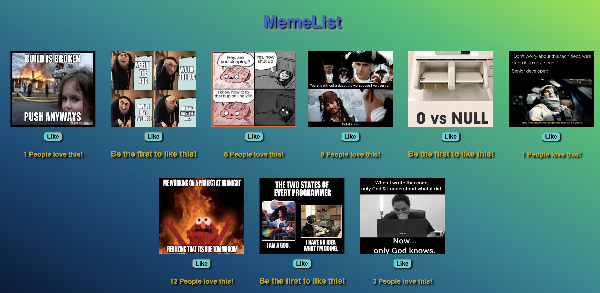

## Project Name

# Weekend React Gallery

## Description

_Duration: 6 hours_

This project utilize React and allows you to add likes to an images(memes) and toggle between the image &image description when clicked. 

## Screen Shot

## Prerequisites 

- React
- Node
- Express

## Installation

1. To install, click the green `code` button at the top this page. Fork and clone this repo.

2. Open the project in a code editor of your choice and run the following command `npm install` in the terminal. 

3. It helps to have split the terminal in 3 tabs, with one being used for git add or commits. In the second tab you'll need to run `npm run server` and for the third tab use `npm run client`. This will automatically open a new window with localhost.

## Built With 

- React
- Node
- Express 
- JavaScript
- CSS
- HTML

## Acknowledgement 

Thanks to [Prime Digital Academy](www.primeacademy.io) who equipped and helped me to make this application a reality. (Thank you, Prime!)